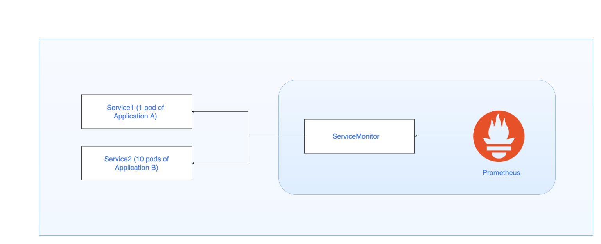

# prometheus-monitors

Repository for configuring prometheus scrape settings for pods.

Table of Contents
=================

[Usage](#usage)
* [Pre-requisites](#pre-requisites)
* [Sample Config](#sample-config)
* [API Spec](#api-spec)
* [Deployment](#deployment)

## Usage

You need to define a new resource of type `ServiceMonitor` which describes the set of targets to be monitored by Prometheus.

Inorder, to avoid having to define a `ServiceMonitor` file for each application to be scrapped, we use a catch-all approach.

Here, we define a single `ServiceMonitor` file to scrape metrics from all applications running in a particular namespace.



### Pre-requisites

[1] Each application from which you want to scrape the metrics need to expose a service of type `ClusterIP`.

[2] Service needs to have the label `prometheus: "true"`

[3] Service needs to have a port name defined.

In below `Service` configuration, the port name is defined as `http`

e.g.

```
spec:
  ports:
    - name: http
      protocol: TCP
      port: 80
      targetPort: 3000
```

### Sample Config

Below is a sample `ServiceMonitor` config that asks Prometheus to scrape metrics from `/prometheus` HTTP path through a service port named `http` fulfilling below filter conditions:

[1] Scraping to be done only for applications running under `application` namespace

[2] Scraping to be done only for Services that have `prometheus: "true"` label 

```yml
apiVersion: monitoring.coreos.com/v1
kind: ServiceMonitor
metadata:
  name: spring-boot-app
  namespace: application
  labels:
    app: spring-boot-app
    release: prometheus
spec:
  namespaceSelector:
    matchNames:
      - application
  selector:
    matchLabels:
      prometheus: "true"
  endpoints:
  - port: http
    path: /prometheus
```

### API Spec

|Field|Description|Comments|
|--|--|--|
|namespaceSelector |Selector to select which namespaces the Endpoints objects are discovered from. |Here you give the namespace in which your application pods are running  |
|selector |Selector to select Endpoints objects. |Here you give the labels to match with your pods  |
|endpoints |A list of endpoints allowed |Here you give the service port name and scrape path for metrics  |

### Deployment

Once you have added/updated a `ServiceMonitor` config, apply the changes referencing below sample command:

`Note: You need to set kubectl context to the correct EKS cluster`

```
kubectl apply -f app-service-monitor.yaml
```
